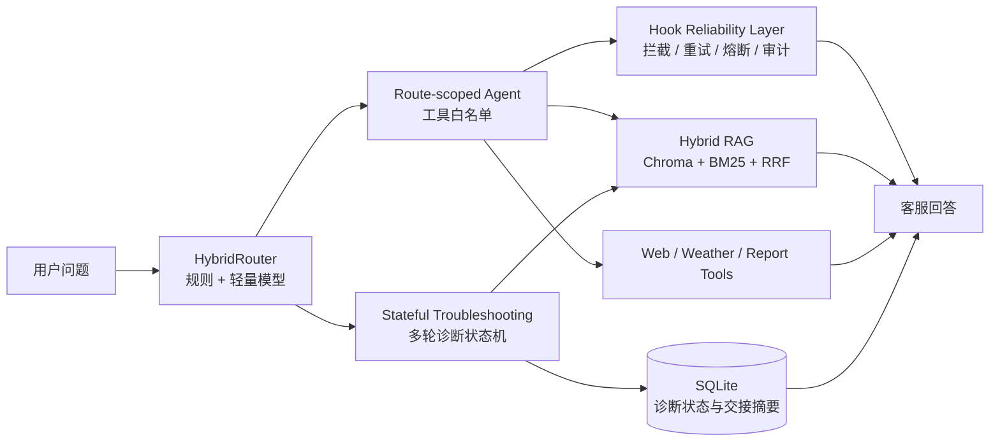

# RoboCare 智能客服系统

<p align="center">
  <strong>面向扫地机器人场景的可评测、可诊断、可治理客服 Agent</strong>
</p>

<p align="center">
  RoboCare 将知识检索、任务路由、多轮故障诊断与工具可靠性治理组合成一条完整的客服执行链路。
</p>

<p align="center">
  
  
  
  
</p>

> RoboCare 是系统品牌；知识库中的“智扫通”是被客服服务的业务产品品牌。两者保持清晰分离，便于替换产品知识而不改变 Agent 平台。

## 体验界面

RoboCare 提供一个面向客服工作流的聊天工作台，支持产品咨询、故障排查、天气适配、个人设备报告和多轮诊断状态展示。

启动工作台后即可体验完整的客服交互、路由状态和诊断状态展示。

## 为什么是 RoboCare

| 能力 | 用户看到的结果 | 工程实现 |
| --- | --- | --- |
| Hybrid RAG | 更稳定、更贴近业务卡片的知识回答 | Vector + BM25 + RRF + qwen3-rerank |
| 自适应任务路由 | 不同问题进入匹配的执行链路 | 规则引擎 + 轻量模型 + 工具白名单 |
| 多轮故障诊断 | 能记住已完成动作，避免重复建议 | 短期对话记忆 + SQLite 状态 + 动作组编排 |
| Hook 生命周期治理 | 工具失败可控，调用过程可追溯 | 拦截、超时、重试、熔断、结果校验、脱敏审计 |

## 核心链路



## 项目亮点

### 1. Hybrid RAG 检索优化

面向客服知识卡片构建评测集，使用 Vector 与 BM25 进行 RRF 融合召回，再通过 `qwen3-rerank` 完成二阶段重排。检索链路保留 `card_id`、来源文件和 metadata，便于回答复盘。

### 2. 自适应任务路由与 Agent 评测

通过规则引擎与轻量模型协同完成分层意图路由，将直接回答、本地知识检索、联网检索、业务查询和故障诊断分配到受限工具集合，并使用困难客服问题集评估路由与工具选择质量。

### 3. 多轮故障诊断与状态管理

融合短期对话记忆与持久化诊断状态，基于用户反馈动态编排排障动作组并推进状态迁移。系统能够识别已完成动作、避免无效重复建议，并在高风险或多次未解决时生成结构化交接摘要。

### 4. Hook 生命周期治理

基于 LangChain middleware 统一实现工具调用前策略拦截、调用中超时重试与熔断降级、调用后结果校验与结构化脱敏审计，提升客服 Agent 异常链路的可恢复性、可观测性与工程化可复盘性。

## 技术架构

```text
Streamlit Workbench
        │
ReactAgent Controller
        ├── HybridRouter
        ├── Route-scoped LangChain Agents
        ├── TroubleshootingEngine
        └── LangChain Middleware / Hook Manager
                │
        ┌───────┴────────┐
        │                │
   Local RAG        Business Tools
 Chroma + BM25      Weather / Web / Report
        │                │
        └───────┬────────┘
                │
       SQLite Diagnosis Store
```

## 快速启动

建议使用 Python 3.11 或以上版本：

```bash
pip install -r requirements.txt
cp .env.example .env
streamlit run app.py
```

启动后访问 Streamlit 输出的本地地址，通常为 `http://localhost:8501`。

RoboCare 的前端工作台和 Agent 后端执行链路由同一个 Streamlit 进程承载，不需要单独启动 FastAPI 服务。工具调用、RAG 检索、诊断状态和 Hook 审计在同一会话上下文中协同工作。

## 评测与验证

项目包含检索、生成、路由和状态化诊断评测脚本：

```bash
python -m rag.retriever_evaluation --reset-index --top-k 1 --strategies vector,bm25,fusion,fusion_rerank
python -m rag.generation_evaluation --strategies vector,fusion_rerank --skip-load-documents
python -m agent.route_evaluation --dataset data/agent_route_eval_hard_dataset.csv
python -m agent.troubleshooting_evaluation --dataset data/diagnosis_eval_hard_dataset.csv
```

测试套件覆盖路由决策、工具权限、RAG 服务、诊断状态、自然反馈解析、Hook 可靠性和集成链路。

## 目录结构

```text
.
├── app.py                         # Streamlit 聊天工作台
├── agent/
│   ├── react_agent.py             # Agent 控制器与流式执行
│   ├── routing.py                 # 规则 + 轻量模型路由
│   ├── troubleshooting/           # 多轮诊断状态机与持久化状态
│   ├── hooks/                     # 生命周期、策略、脱敏、审计与报表
│   └── tools/                     # LangChain 工具与业务服务层
├── rag/                           # Chroma、BM25、RRF、Reranker 与评测
├── websearch/                     # 搜索、抓取、过滤、去重与 TTL 缓存
├── data/                          # 产品知识、评测集与演示数据
├── config/                        # Agent、RAG、诊断和 Web 配置
├── prompts/                       # Agent、RAG、报告生成提示词
└── docs/                          # 分阶段设计与验收文档
```

## 安全与运行说明

- API Key 只放在本地 `.env`，不会提交到 Git；
- 工具审计日志只保存脱敏摘要，不直接写入完整敏感参数；
- 外部搜索、天气和 Judge 评测会调用第三方 API，需要对应配置；
- Chroma、SQLite、缓存和运行日志属于本地运行产物，不作为源码依赖提交；
- 生产环境部署多实例时，应将 Hook 熔断状态迁移到共享存储，例如 Redis。

## 项目定位

RoboCare 不是一个只会回答问题的聊天 Demo，而是一套围绕客服业务设计的 Agent 工程系统：

```text
知识有依据       → Hybrid RAG 与评测集
任务有分流       → 自适应路由与工具隔离
故障有状态       → 多轮诊断与动作组编排
工具有边界       → Hook 可靠性与审计治理
```
