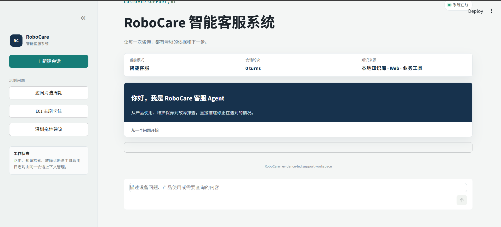
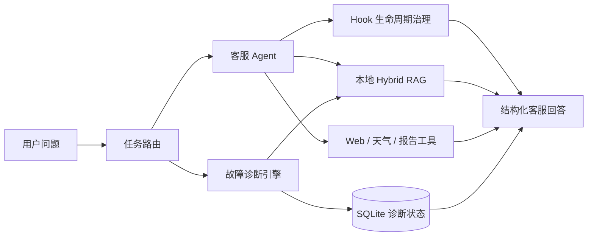

# RoboCare 智能客服系统

<p align="center">
  <strong>面向扫地机器人场景的客服 Agent 工作台</strong>
</p>

<p align="center">
  RoboCare 将产品知识问答、联网信息补充、设备报告、故障排查和工具治理组合为一套可运行的客服系统。
</p>

<p align="center">
  
  
  
  
</p>

## 界面预览

<p align="center">
  
</p>

工作台支持新建会话、快捷问题、流式回答、会话上下文和诊断状态展示。系统品牌为 RoboCare，知识库中的“智扫通”是用于演示的机器人产品品牌。

## 能力范围

| 场景 | 处理方式 |
| --- | --- |
| 产品问答、选购与维护 | 从本地产品知识库检索依据并组织回答 |
| 最新品牌与市场信息 | 通过 Web Search 获取外部信息并保留来源 trace |
| 天气适配 | 查询指定城市天气，给出扫地或拖地建议 |
| 个人设备报告 | 从 SQLite 查询设备使用记录并生成报告 |
| 多轮故障排查 | 根据诊断状态、用户反馈和动作组推进排障 |
| 工具执行保护 | 对工具调用执行拦截、重试、熔断、结果校验和脱敏审计 |

## 工作方式



路由负责确定问题进入哪条执行链路；Agent 只接收当前链路允许的工具；故障诊断由独立的状态化引擎推进；所有工具调用经过统一的 middleware Hook。

## 技术组成

- **Agent runtime**：LangChain Agent API，底层由 LangGraph 承载执行状态；
- **本地检索**：Chroma 向量检索、BM25、RRF 融合召回和 `qwen3-rerank` 重排；
- **任务路由**：规则引擎处理确定性请求，轻量模型处理冲突和模糊意图；
- **故障诊断**：短期会话上下文、SQLite 持久化状态、语义反馈解析和动作组编排；
- **工具服务**：本地 RAG、Web Search、天气查询和设备报告统一封装为 LangChain tools；
- **可靠性治理**：调用前策略拦截，调用中超时、有限重试和熔断，调用后结果校验与脱敏审计；
- **前端**：Streamlit 客服工作台，前端与 Agent 后端执行链路由同一进程承载。

## 快速开始

环境要求：Python 3.11 或以上版本。

```bash
git clone https://github.com/wangzihang33/zhisaotong.git
cd zhisaotong
python -m venv .venv

# Windows
.venv\Scripts\activate

# macOS / Linux
# source .venv/bin/activate

pip install -r requirements.txt
copy .env.example .env
streamlit run app.py
```

启动后打开 Streamlit 输出的地址，通常为：

```text
http://localhost:8501
```

RoboCare 不需要单独启动 FastAPI 服务。Streamlit 进程会同时承载页面、Agent 控制器、RAG 检索、诊断状态和工具调用链路。

## 配置

复制 `.env.example` 为 `.env`，按需配置：

| 变量 | 用途 |
| --- | --- |
| `MAIN_DEEPSEEK_API_KEY` | 主客服 Agent 模型 |
| `ROUTER_DEEPSEEK_API_KEY` | 路由轻量模型 |
| `DASHSCOPE_API_KEY` | Embedding 与 Reranker |
| `SERPER_API_KEY` | Web Search |
| `AMAP_KEY` | 天气查询 |
| `DIAGNOSIS_DB_PATH` | 诊断状态与交接摘要 SQLite |

不要把真实 API Key 写入源码、README、评测数据或日志。`.env`、运行时 SQLite、Chroma 索引、缓存和 Hook 日志均不应提交到仓库。

## 评测与测试

检索评测：

```bash
python -m rag.retriever_evaluation --reset-index --top-k 1 --strategies vector,bm25,fusion,fusion_rerank
python -m rag.generation_evaluation --strategies vector,fusion_rerank --skip-load-documents
```

路由与诊断评测：

```bash
python -m agent.route_evaluation --dataset data/agent_route_eval_hard_dataset.csv
python -m agent.troubleshooting_evaluation --dataset data/diagnosis_eval_hard_dataset.csv
```

运行自动化测试：

```bash
python -m pytest tests -q
```

测试覆盖路由决策、工具白名单、提示词过滤、RAG 服务、诊断状态迁移、自然语言反馈、Hook 可靠性和集成执行链路。

## 目录结构

```text
.
├── app.py                         # Streamlit 客服工作台
├── agent/
│   ├── react_agent.py             # Agent 控制器与流式执行
│   ├── routing.py                 # 任务路由与工具集合
│   ├── troubleshooting/           # 多轮故障诊断与持久化状态
│   ├── hooks/                     # 生命周期、策略、脱敏和审计
│   └── tools/                     # LangChain tools 与业务服务层
├── rag/                           # Chroma、BM25、RRF、Reranker 和评测
├── websearch/                     # 搜索、抓取、过滤和 TTL 缓存
├── data/                          # 产品知识、评测集和演示数据
├── config/                        # Agent、RAG、诊断和 Web 配置
├── prompts/                       # Agent、RAG、报告提示词
├── docs/                          # 设计文档、验收记录和界面截图
└── tests/                         # 自动化测试
```

## 运行边界

- 当前项目使用 Streamlit 单进程承载前端和 Agent 执行链路；
- Hook 熔断状态保存在当前 Python 进程内，多实例部署时应迁移到 Redis 等共享存储；
- 外部搜索、天气和模型评测需要对应 API 配置；
- 本地知识库内容是演示产品资料，替换 `data/` 后需重新构建向量索引；
- 真实生产环境还需要接入认证、限流、密钥托管和客服平台工单系统。
